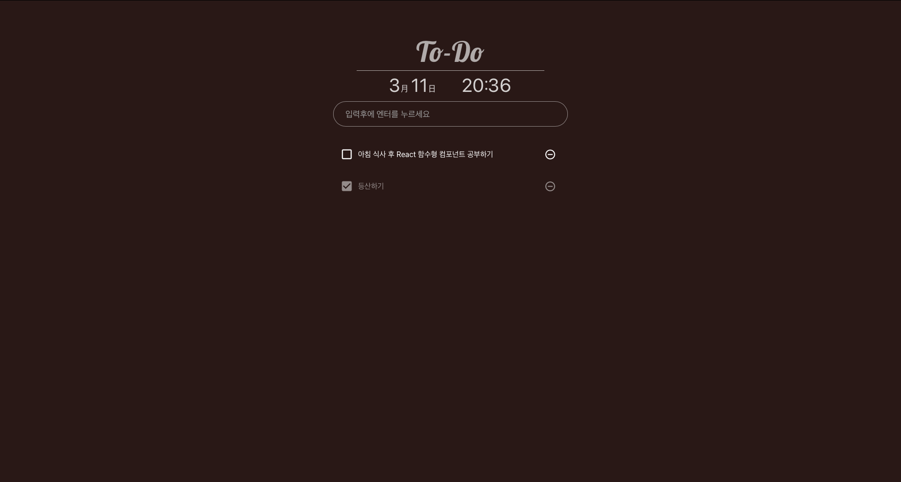

## React를 활용한 To-Do 애플리케이션

리액트를 활용한 첫 프로젝트 입니다.
리액트의 기본적인 props, state, hook을 학습하고 만들어본 To-Do 앱 입니다.

mobile 레이아웃 작업을 통해 모바일에서도 부드러운 화면을 유지할 수 있습니다.

[DEMO 바로가기](https://to-2hud05hf6-myeongin.vercel.app/)

## 기능

- 화면에 시간을 표시하는 기능을 넣어두었으며 타이머를 설정해 함수가 계속 호출되는 것을 방지해두었습니다.

- Input 요소에 하고자 하는 일을 작성후
  Enter키를 통해 항목을 등록할 수 있습니다.
- 각각의 요소에 있는 Delete Icon을 클릭해 항목을 삭제할 수 있습니다.
- LocalStorage를 통해 항목들을 저장되게 하였으며 삭제 기능도 구현하였습니다.

## 수정

23-03-14 최적화&오류 수정

## 회고

기능 자체는 크게 어려운 점이 없었지만 Safari에서 특정 이벤트들이 적용이 안되어  
코드를 여러번 수정하였습니다. 아직은 Chrome, Safari 두 개의 브라우저만 확인하였지만  
 크로스 브라우징에 더 적합한 코드를 짤 수 있도록 노력해야겠습니다.
